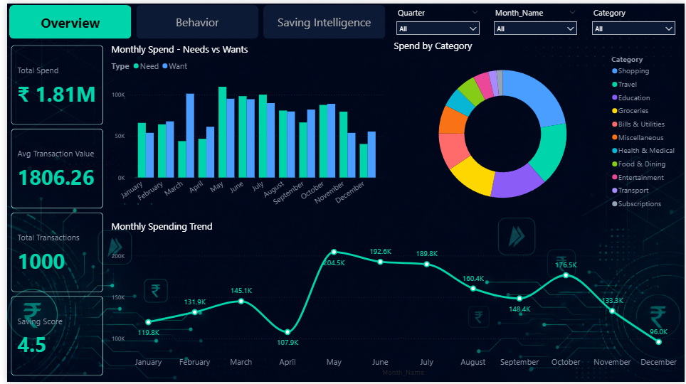
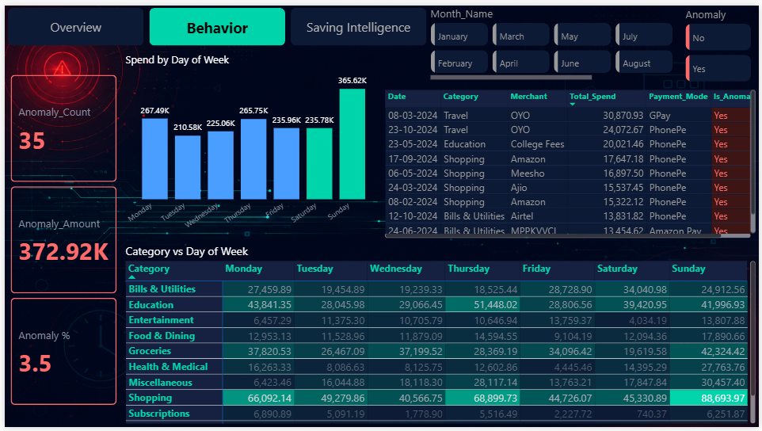
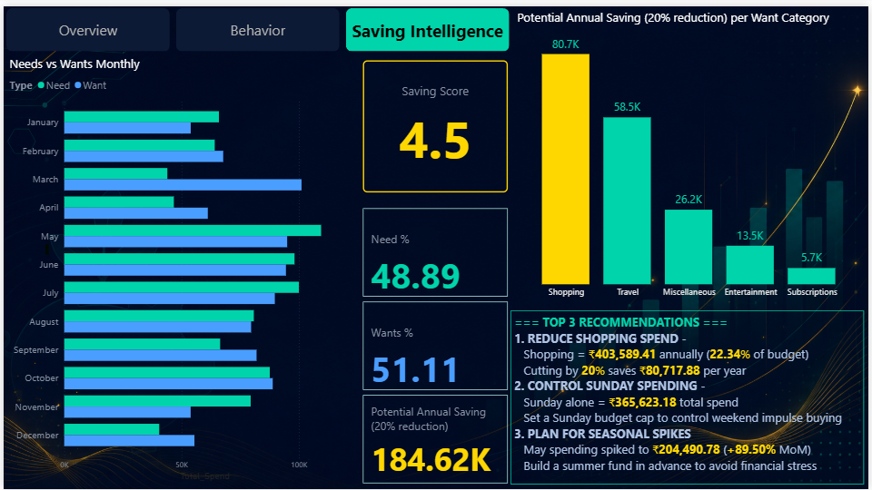

# **UPI Spending Analyzer**

## **Personal Finance Intelligence  - UPI Spending Analyzer | Python + Power BI**


### **Project Overview**


A complete end-to-end data analytics project analyzing 1000+ synthetic UPI transactions to uncover spending patterns, detect anomalies, and provide actionable saving recommendations for a student's financial profile.


### **Problem Statement**


Most individuals have no visibility into where their money goes month by month. This project builds a complete analytics pipeline from raw transaction data to an interactive dashboard — that 

helps identify overspending categories, behavioral patterns, and saving opportunities.


## Tech Stack

### Data Processing


> Cleaned raw UPI transaction data, handled missing values, engineered new features, and prepared the dataset for analysis.


### Data Visualization


> Conducted Exploratory Data Analysis (EDA) and created visualizations to uncover spending patterns, trends, and user behavior.


### Business Intelligence


> Designed an interactive dashboard and developed DAX measures to track KPIs, spending trends, and financial insights.


### Version Control


> Managed version control, hosted the project on GitHub for collaboration and portfolio showcase.


---


### **Dashboard Pages**

<details>

<summary><b>📈 Page 1 - Overview</b></summary>



</details>


<details>

<summary><b>📈Page 2 - Behaviour & Anomalies </b></summary>



</details>


<details>

<summary><b>📈Page 3 - Saving Intelligence </b></summary>



</details>


<br>

### **Top 12 Insights**

1. Shopping consumes **22.34%** of total budget - highest of all categories.

2. Travel has highest avg transaction at **₹5,520 -** big but infrequent spends

3. March had worst spending discipline - **69.71%** went to Wants

4. May spending jumped **+89.50% MoM** driven by summer vacation effect

5. Sunday is the highest spend day - ₹**3,65,623** total

6. Q2 dominated with **₹5,05,040** total spend

7. Education \& Travel tied for most anomalies **12 each**

8. Shopping on Sunday = darkest heatmap cell - highest spend combination

9. Education has highest median transaction + widest spread - most unpredictable category

10. Saving Score = **4.5/10** - poor spending discipline

11. Cutting Shopping 20% saves **₹80,717** annually

12. Wants over budget by **₹31,767 -** Needs actually under budget ✅

<br>

### **Top 3 Business Recommendations**

### **1. Reduce Shopping Spend**
  * Shopping = ₹4,03,589 annually (22.34% of budget).
  * Cutting by 20% saves ₹80,717 per year.


### **2. Control Sunday Spending**
  * Sunday alone = ₹3,65,623 total spend.
  * Set a Sunday budget cap to control weekend impulse buying.


### **3. Plan for Seasonal Spikes**
  * May spending spiked to ₹2,04,490 (+89.50% MoM).
  * Build a summer fund in advance to avoid financial stress.

<br>

## 📂 Project Structure

```text
UPI-Spending-Analyzer/
│
├── 📊 Dashboard/
│   ├── UPI_Spending_Analyzer.pbix
│   └── UPI_Dashboard.pdf
│
├── 📁 Data/
│   ├── upi_raw.csv
│   └── upi_cleaned.csv
│
├── 📓 Notebooks/
│   ├── upi_eda.ipynb
│   └── upi_analysis.ipynb
│
├── 🖼️ Visuals/
│   ├── EDA Charts
│   └── Dashboard Screenshots
│
└── 📄 README.md
```


## **Author**


### **ASIF KHAN**
#### ***Data Analyst | Python | SQL | Power BI | Tableau | Excel***

* **[LinkedIn]** - ***https://www.linkedin.com/in/asif-khan-data-analyst/***

* **[Gmail]** - ***akhan749943@gmail.com***


